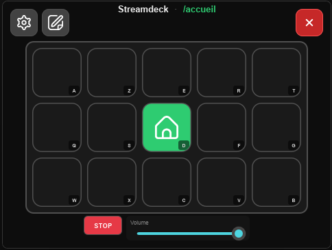

# Streamdeck

Mini Stream Deck logiciel — grille **5×3**, navigation par pages, UI sombre.

Stack : Rust · Slint · SQLite · binaire `sd-rs`.



## Développement

Prérequis : Rust, MSVC Build Tools (C++), ffmpeg dans `tools/ffmpeg/`.  
→ [INSTALL.md](INSTALL.md)

```powershell
cd streamdeck
cargo run
```

Release : `cargo build --release` → `target\release\sd-rs.exe`

## Fonctionnalités

- Touches : son, dossier, script, alarme / minuteur
- Bibliothèques sons & images, capture micro / sortie PC, clip fichier ou URL
- Raccourcis clavier de grille
- UI **English** by default — switch to Français in Settings → Application

Guide utilisateur : [GUIDE.md](GUIDE.md)

## ffmpeg et yt-dlp

L’app cherche d’abord `tools/`, puis le PATH. Installation : [tools/README.md](tools/README.md).

| Outil | Rôle | Requis ? |
|-------|------|----------|
| **ffmpeg** (+ ffprobe) | Import / clip / capture : conversion audio et **normalisation LUFS** (cible des réglages, défaut −16). Analyse des formes d’onde. | Fortement recommandé |
| **yt-dlp** | Téléchargement audio depuis une **URL** (YouTube, etc.), puis conversion via ffmpeg. | Optionnel (fonction URL) |

Sans ffmpeg : l’app démarre, mais volumes non uniformisés et clip / URL limités.  
Sans yt-dlp : la bibliothèque et la capture restent utilisables ; seul l’import par URL est indisponible.

## Distribution

1. [tools/README.md](tools/README.md) — placer les binaires  
2. [PACKAGING.md](PACKAGING.md) — `scripts\prepare-release.ps1`  
3. [THIRD_PARTY.md](THIRD_PARTY.md) — licences
